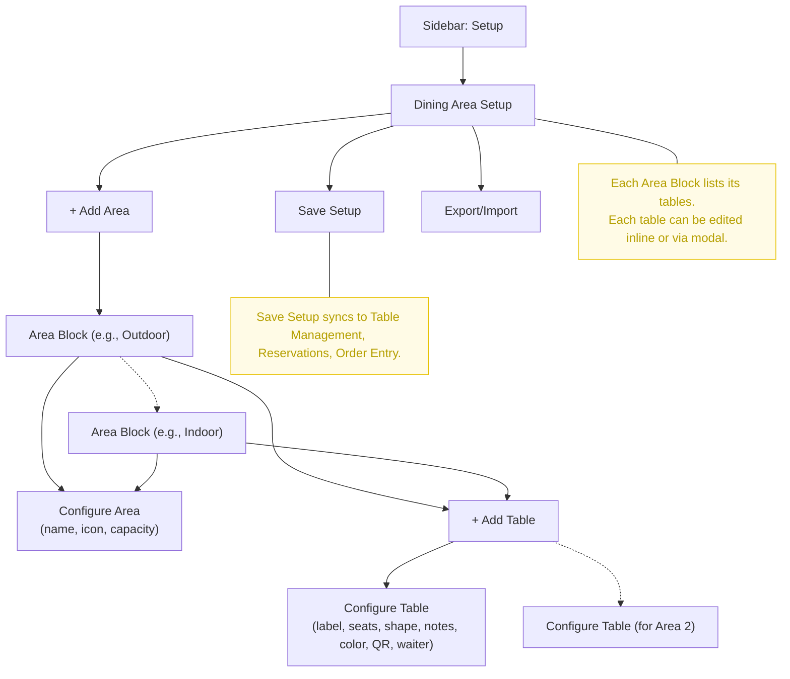

# Dining Area Setup Workflow

## UI Wireframe / Flowchart

## Key UI/UX Flow
- **Sidebar:** "Setup" > "Dining Area Setup"
- **Main Area:**
  - "+ Add Area" button
  - For each area: Area block with config, "+ Add Table" inside area
  - For each table: Table config (label, seats, shape, notes, color, QR, waiter)
  - "Save Setup" and "Export/Import" at the bottom

**Notes:**
- Each area block lists its tables.
- Each table can be edited inline or via modal.
- Saving setup syncs changes to all relevant modules (Table Management, Reservations, Order Entry). 